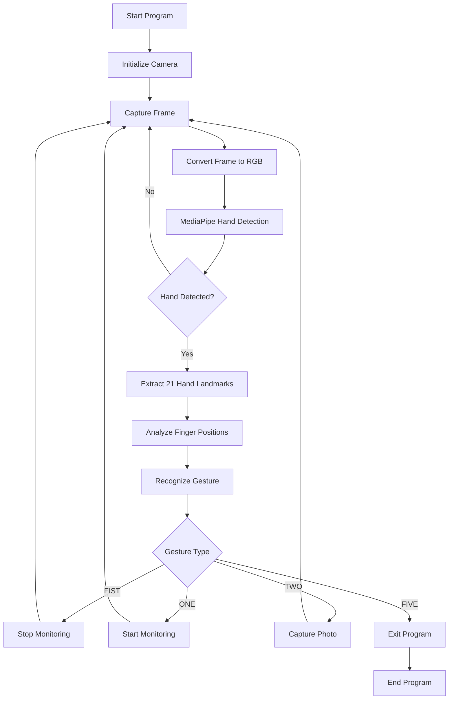
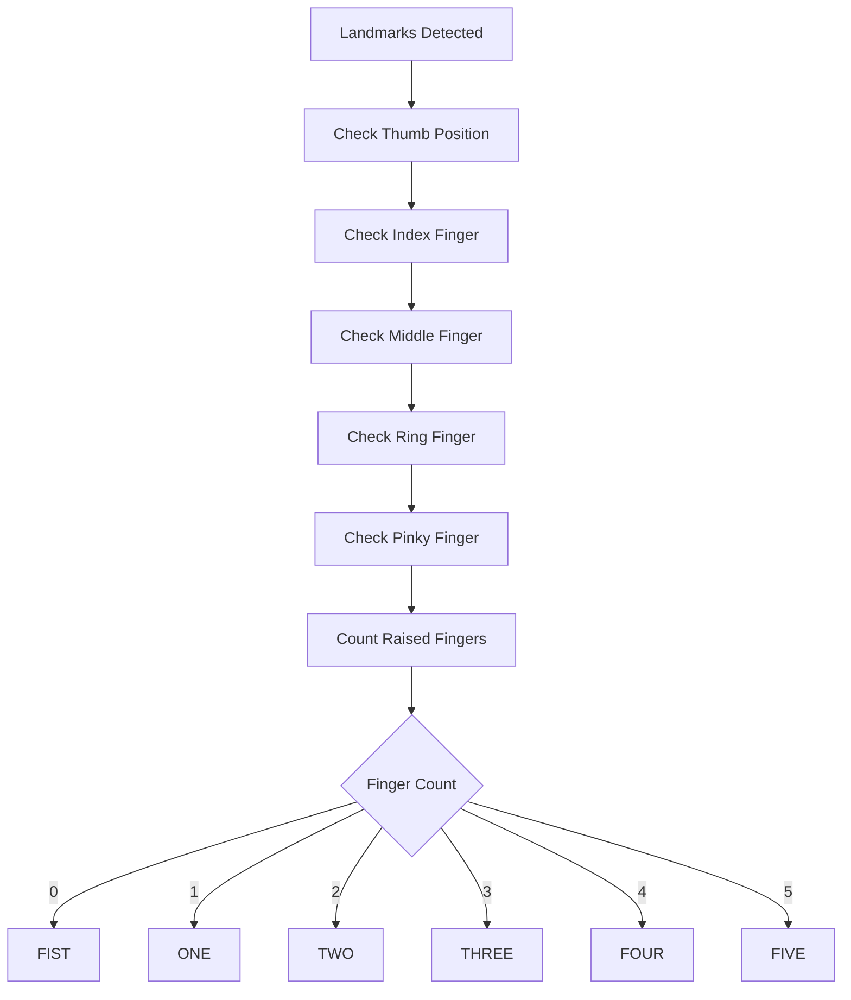
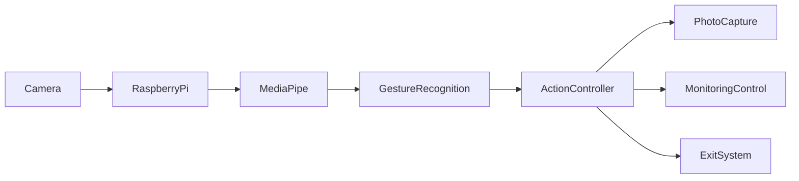

# GestureCam AI – System Flowcharts

This document explains the internal workflow of the GestureCam AI system.

Built on Raspberry Pi using MediaPipe and OpenCV.

---

# 1. System Workflow

---

# 2. Gesture Recognition Logic

---

# 3. High-Level System Architecture

